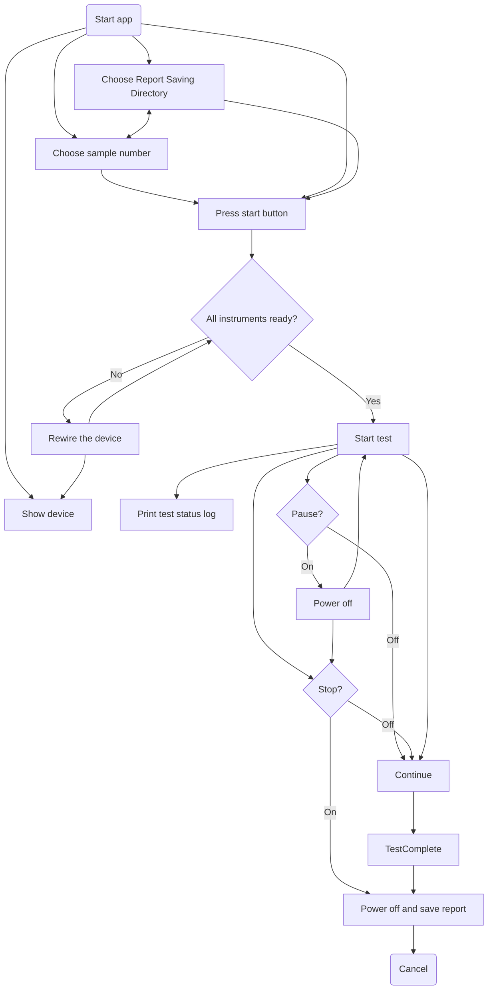

# instrument_remote_control

programmatic control instrument system to run remote control for measuring properties of test samples

## User Flow Diagram



## Dependency

### pyvisa
installing dependent python package([step](https://www.lockinc.com.tw/files/%E6%8A%80%E8%A1%93%E7%B0%A1%E4%BB%8B%E3%80%8A%E7%A4%BA%E6%B3%A2%E5%99%A8%E8%87%AA%E5%8B%95%E5%8C%96%E5%92%8C%20Python%20%E5%85%A5%E9%96%80%E3%80%8B_%E4%B8%AD%E6%96%87%E7%89%88_.pdf))
> For pip SSL error, use [`trusted-host`](https://stackoverflow.com/questions/25981703/pip-install-fails-with-connection-error-ssl-certificate-verify-failed-certi) command.

#### using pip
```sh
pip install --trusted-host pypi.org --trusted-host pypi.python.org --trusted-host files.pythonhosted.org pyvisa
```
#### using conda
```sh
conda install -c conda-forge pyvisa
```
[user guide](https://pyvisa.readthedocs.io/en/latest/_modules/pyvisa/highlevel.html#)

### matplotlib
#### For conda user
```sh
conda install matplotlib
```
[other install instruction](https://www.geeksforgeeks.org/install-matplotlib-python/)

### openpyxl

Ouputing report to an excel form.
> [openpyxl tutorial](https://openpyxl.readthedocs.io/en/stable/tutorial.html)

### [PySimpleGUI](https://www.pysimplegui.org/en/latest/)

## Running

In the command window, redirect to the repo folder:

```sh
python .\controller.py
```

use --help for usage of optional flags
```sh
python .\controller.py --help 
```

## Reference

### Instrument

#### signal generator

* [AGF31000](https://download.tek.com/manual/077147303_AFG31000_Series_User_Manual_EN_Nov2020.pdf)
* [send waveform example](https://github.com/tektronix/Programmatic-Control-Examples/blob/master/Examples/Signal_Sources/src/AFG3KSendWaveformExample/python/afg3k_send_wfm_1.py)

### GUI

[Working Remotely with Tektronix Oscilloscopes](https://www.tek.com/en/documents/technical-brief/working-remotely-with-tek-scopes-tech-brief) mentioned free user made software [TekScope Utility](https://forum.tek.com/viewtopic.php?t=140451#p284900) and official free [Tektronix Openchoice Desktop Application](https://www.tek.com/en/support/software/utility/tektronix-openchoice-desktop-application-tdspcs1--v28) and cost [Keithley KickStart Software](https://www.tek.com/en/products/keithley/keithley-control-software-bench-instruments/kickstart). Also there is official proprietary software [tekscope](https://www.tekcloud.com/tekscope/).
* model-view-controller (MVC) pattern [example](https://www.pythontutorial.net/tkinter/tkinter-mvc/)
* [Tektronix provided GUI example](https://github.com/tektronix/keithley/blob/7a7c60ce6ac114b7fee00d9f216cdbfedcdc9396/Instrument_Examples/General/Creating_GUIs/instrgui.py
)
