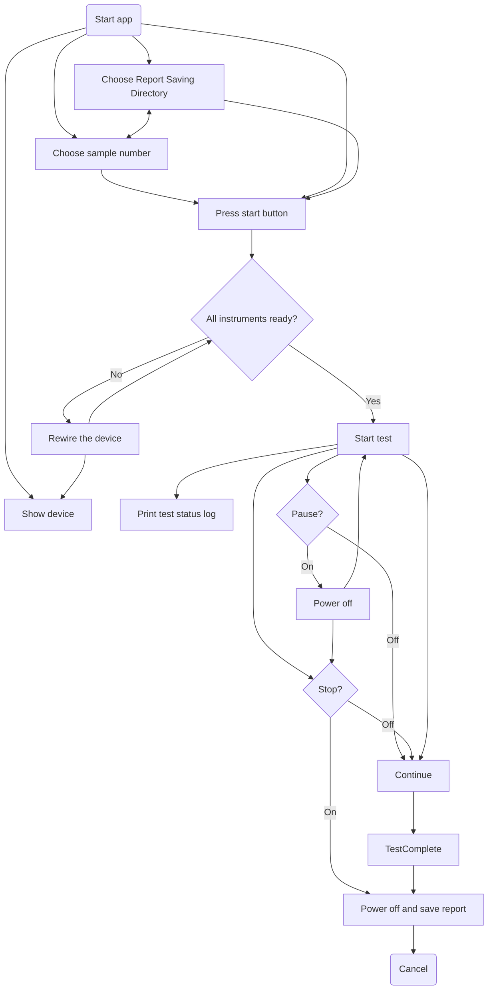

# instrument_remote_control

programmatic control instrument system to run remote control for measuring properties of test samples

## User Flow Diagram



## Installing

### Windows OS

#### pyvisa

installing dependent python package([step](https://www.lockinc.com.tw/files/%E6%8A%80%E8%A1%93%E7%B0%A1%E4%BB%8B%E3%80%8A%E7%A4%BA%E6%B3%A2%E5%99%A8%E8%87%AA%E5%8B%95%E5%8C%96%E5%92%8C%20Python%20%E5%85%A5%E9%96%80%E3%80%8B_%E4%B8%AD%E6%96%87%E7%89%88_.pdf))
> For pip SSL error, use [`trusted-host`](https://stackoverflow.com/questions/25981703/pip-install-fails-with-connection-error-ssl-certificate-verify-failed-certi) command.

```sh
pip install --trusted-host pypi.org --trusted-host pypi.python.org --trusted-host files.pythonhosted.org pyvisa
```

#### openpyxl

#### PySimpleGUI

## Reference

[Working Remotely with Tektronix Oscilloscopes](https://www.tek.com/en/documents/technical-brief/working-remotely-with-tek-scopes-tech-brief) mentioned free user made software [TekScope Utility](https://forum.tek.com/viewtopic.php?t=140451#p284900) and official free [Tektronix Openchoice Desktop Application](https://www.tek.com/en/support/software/utility/tektronix-openchoice-desktop-application-tdspcs1--v28) and cost [Keithley KickStart Software](https://www.tek.com/en/products/keithley/keithley-control-software-bench-instruments/kickstart). Also there is official proprietary software [tekscope](https://www.tekcloud.com/tekscope/).